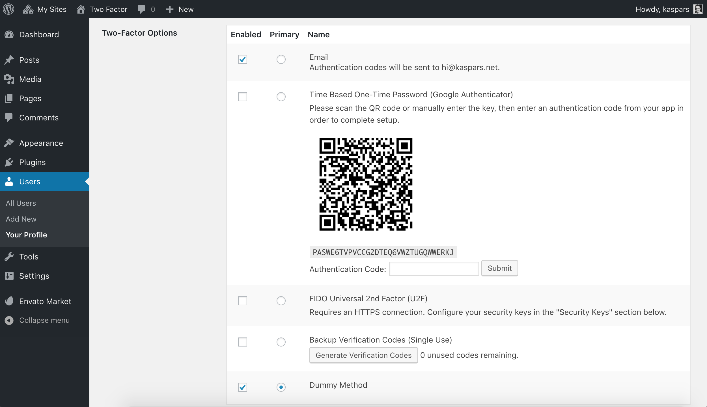
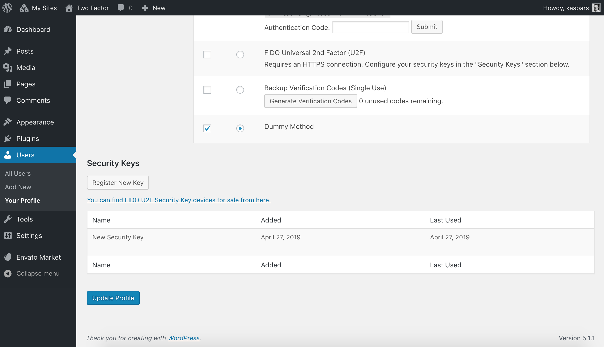
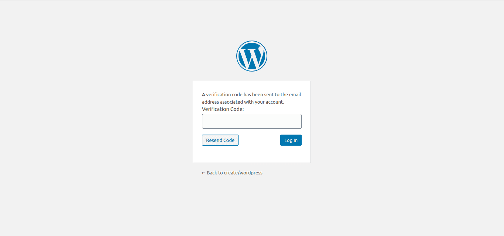

# Wordpress Two - Factor Login

## Description ##

Use the "Two-Factor Options" section under "Users" → "Your Profile" to enable and configure one or multiple two-factor authentication providers for your account:

- Email codes
- Time Based One-Time Passwords (TOTP)
- FIDO Universal 2nd Factor (U2F)
- Backup Codes
- Dummy Method (only for testing purposes)

## Screenshots ##

### Two-factor options under User Profile.

### U2F Security Keys section under User Profile.

### Email Code Authentication during WordPress Login.

